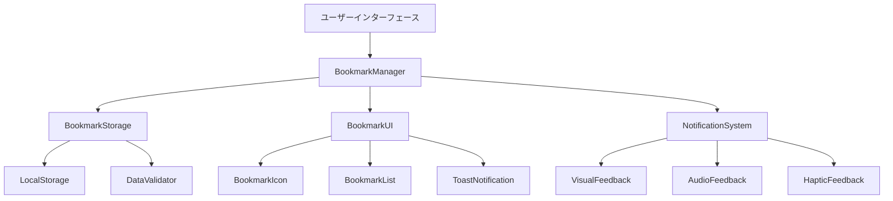

# ブックマーク機能改善 - 設計書

## 概要

現在の「あとで見る」機能を、より直感的で使いやすいブックマーク機能に改善する。視覚的改善、機能発見性の向上、状態管理の強化、管理機能の拡充を通じて、ユーザー体験を大幅に向上させる。

## アーキテクチャ

### システム構成



### 主要コンポーネント

1. **BookmarkManager**: ブックマーク機能の中核管理クラス
2. **BookmarkStorage**: データ永続化とクリーンアップ
3. **BookmarkUI**: UI要素の管理と更新
4. **NotificationSystem**: ユーザーフィードバック管理

## コンポーネント設計

### 1. BookmarkManager クラス

```javascript
class BookmarkManager {
    constructor(archiveManager) {
        this.archiveManager = archiveManager;
        this.storage = new BookmarkStorage();
        this.ui = new BookmarkUI(this);
        this.notifications = new NotificationSystem();
        this.bookmarks = new Set();
        this.isFirstVisit = this.checkFirstVisit();
    }

    // 主要メソッド
    async addBookmark(videoId)
    async removeBookmark(videoId)
    toggleBookmark(videoId)
    getBookmarkCount()
    getBookmarks()
    showBookmarkList()
    clearAllBookmarks()
}
```

### 2. BookmarkStorage クラス

```javascript
class BookmarkStorage {
    constructor() {
        this.storageKey = 'holoSummary_bookmarks';
        this.backupKey = 'holoSummary_bookmarks_backup';
    }

    // データ操作
    save(bookmarks)
    load()
    backup()
    restore()
    cleanup(validVideoIds)
    migrate() // 既存データの移行
}
```

### 3. BookmarkUI クラス

```javascript
class BookmarkUI {
    constructor(bookmarkManager) {
        this.manager = bookmarkManager;
        this.iconElements = new Map();
        this.listContainer = null;
    }

    // UI管理
    createBookmarkIcon(videoId, isActive)
    updateBookmarkIcon(videoId, isActive)
    updateBookmarkCounter(count)
    showBookmarkList()
    hideBookmarkList()
    renderBookmarkItem(archive)
}
```

## データモデル

### ブックマークデータ構造

```javascript
// 新しいブックマークデータ構造
const bookmarkData = {
    version: "2.0",
    bookmarks: [
        {
            videoId: "string",
            addedAt: "ISO8601 timestamp",
            title: "string", // キャッシュ用
            streamer: "string", // キャッシュ用
            thumbnailUrl: "string" // キャッシュ用
        }
    ],
    settings: {
        sortOrder: "dateAdded|datePublished|streamer",
        showNotifications: true,
        enableHaptics: true
    }
};
```

### 既存データとの互換性

```javascript
// 既存データの移行処理
class DataMigration {
    static migrateFromV1(oldData) {
        // 既存のwatchLaterList (Set<string>) を新形式に変換
        const bookmarks = Array.from(oldData).map(videoId => ({
            videoId,
            addedAt: new Date().toISOString(),
            title: null, // 後で補完
            streamer: null,
            thumbnailUrl: null
        }));
        
        return {
            version: "2.0",
            bookmarks,
            settings: {
                sortOrder: "dateAdded",
                showNotifications: true,
                enableHaptics: true
            }
        };
    }
}
```

## UI/UXデザイン

### 1. ブックマークアイコンの改善

#### 現在の実装
```css
.bookmark-icon {
    width: 30px;
    height: 30px;
    background-color: rgba(0, 0, 0, 0.7);
    border-radius: 50%;
}
```

#### 改善後の実装
```css
.bookmark-icon {
    width: 36px;
    height: 36px;
    border-radius: 8px;
    background: linear-gradient(135deg, 
        rgba(255, 255, 255, 0.9), 
        rgba(255, 255, 255, 0.7));
    backdrop-filter: blur(10px);
    border: 1px solid rgba(255, 255, 255, 0.3);
    box-shadow: 0 2px 8px rgba(0, 0, 0, 0.15);
    transition: all 0.3s cubic-bezier(0.4, 0, 0.2, 1);
    position: relative;
    overflow: hidden;
}

.bookmark-icon::before {
    content: '';
    position: absolute;
    top: 0;
    left: -100%;
    width: 100%;
    height: 100%;
    background: linear-gradient(90deg, 
        transparent, 
        rgba(255, 255, 255, 0.4), 
        transparent);
    transition: left 0.5s;
}

.bookmark-icon:hover::before {
    left: 100%;
}

.bookmark-icon:hover {
    transform: scale(1.1);
    box-shadow: 0 4px 16px rgba(0, 0, 0, 0.25);
}

.bookmark-icon.active {
    background: linear-gradient(135deg, #ff6b6b, #ee5a52);
    color: white;
    transform: scale(1.05);
}

.bookmark-icon.active::after {
    content: '✓';
    position: absolute;
    bottom: -2px;
    right: -2px;
    width: 14px;
    height: 14px;
    background: #4caf50;
    border-radius: 50%;
    font-size: 8px;
    display: flex;
    align-items: center;
    justify-content: center;
    color: white;
}

/* アニメーション効果 */
@keyframes bookmarkAdded {
    0% { transform: scale(1); }
    50% { transform: scale(1.3); }
    100% { transform: scale(1.05); }
}

.bookmark-icon.animate-added {
    animation: bookmarkAdded 0.4s ease-out;
}
```

### 2. ブックマークボタンの改善

```html
<button id="watch-later" class="bookmark-main-btn">
    <div class="bookmark-icon-wrapper">
        <span class="bookmark-icon">🔖</span>
        <span class="bookmark-count" data-count="0">0</span>
    </div>
    <span class="bookmark-label">ブックマーク</span>
    <div class="tooltip">
        <span class="tooltip-text">保存した配信を確認</span>
        <div class="tooltip-arrow"></div>
    </div>
</button>
```

```css
.bookmark-main-btn {
    position: fixed;
    bottom: 20px;
    left: 30px;
    background: linear-gradient(135deg, #667eea 0%, #764ba2 100%);
    color: white;
    border: none;
    border-radius: 50px;
    padding: 12px 20px;
    display: flex;
    align-items: center;
    gap: 8px;
    box-shadow: 0 4px 20px rgba(102, 126, 234, 0.4);
    transition: all 0.3s ease;
    z-index: 1000;
}

.bookmark-count {
    background: #ff4757;
    color: white;
    border-radius: 50%;
    width: 20px;
    height: 20px;
    font-size: 12px;
    font-weight: bold;
    display: flex;
    align-items: center;
    justify-content: center;
    position: absolute;
    top: -5px;
    right: -5px;
    transform: scale(0);
    transition: transform 0.3s ease;
}

.bookmark-count[data-count="0"] {
    transform: scale(0);
}

.bookmark-count:not([data-count="0"]) {
    transform: scale(1);
}
```

### 3. ブックマーク一覧の設計

```html
<div class="bookmark-modal" id="bookmark-modal">
    <div class="bookmark-modal-backdrop"></div>
    <div class="bookmark-modal-content">
        <div class="bookmark-header">
            <h2>ブックマーク</h2>
            <div class="bookmark-controls">
                <select class="bookmark-sort">
                    <option value="dateAdded">追加日順</option>
                    <option value="datePublished">配信日順</option>
                    <option value="streamer">配信者順</option>
                </select>
                <button class="bookmark-clear-all">すべて削除</button>
                <button class="bookmark-close">×</button>
            </div>
        </div>
        
        <div class="bookmark-list" id="bookmark-list">
            <!-- 動的に生成される -->
        </div>
        
        <div class="bookmark-empty" style="display: none;">
            <div class="empty-illustration">🔖</div>
            <h3>ブックマークがありません</h3>
            <p>気になる配信を見つけたら、サムネイルの🔖アイコンをクリックして保存しましょう。</p>
        </div>
    </div>
</div>
```

```css
.bookmark-modal {
    position: fixed;
    top: 0;
    left: 0;
    width: 100%;
    height: 100%;
    z-index: 2000;
    display: none;
}

.bookmark-modal.show {
    display: flex;
    align-items: center;
    justify-content: center;
}

.bookmark-modal-backdrop {
    position: absolute;
    top: 0;
    left: 0;
    width: 100%;
    height: 100%;
    background: rgba(0, 0, 0, 0.5);
    backdrop-filter: blur(5px);
}

.bookmark-modal-content {
    position: relative;
    width: 90%;
    max-width: 800px;
    max-height: 80vh;
    background: white;
    border-radius: 16px;
    box-shadow: 0 20px 40px rgba(0, 0, 0, 0.3);
    overflow: hidden;
    animation: modalSlideIn 0.3s ease-out;
}

@keyframes modalSlideIn {
    from {
        opacity: 0;
        transform: translateY(-50px) scale(0.9);
    }
    to {
        opacity: 1;
        transform: translateY(0) scale(1);
    }
}

.bookmark-list {
    max-height: 60vh;
    overflow-y: auto;
    padding: 0 20px;
}

.bookmark-item {
    display: flex;
    align-items: center;
    padding: 16px 0;
    border-bottom: 1px solid #eee;
    transition: background-color 0.2s ease;
}

.bookmark-item:hover {
    background-color: #f8f9fa;
}

.bookmark-item-thumbnail {
    width: 120px;
    height: 68px;
    border-radius: 8px;
    object-fit: cover;
    margin-right: 16px;
}

.bookmark-item-info {
    flex: 1;
    min-width: 0;
}

.bookmark-item-title {
    font-weight: 600;
    margin-bottom: 4px;
    overflow: hidden;
    text-overflow: ellipsis;
    white-space: nowrap;
}

.bookmark-item-meta {
    color: #666;
    font-size: 14px;
}

.bookmark-item-actions {
    display: flex;
    gap: 8px;
}

.bookmark-remove-btn {
    background: #ff4757;
    color: white;
    border: none;
    border-radius: 6px;
    padding: 8px 12px;
    cursor: pointer;
    transition: background-color 0.2s ease;
}

.bookmark-remove-btn:hover {
    background: #ff3742;
}
```

## 通知システム設計

### トースト通知

```javascript
class ToastNotification {
    static show(message, type = 'info', duration = 3000) {
        const toast = document.createElement('div');
        toast.className = `toast toast-${type}`;
        toast.innerHTML = `
            <div class="toast-icon">${this.getIcon(type)}</div>
            <div class="toast-message">${message}</div>
            <button class="toast-close">×</button>
        `;
        
        document.body.appendChild(toast);
        
        // アニメーション
        requestAnimationFrame(() => {
            toast.classList.add('toast-show');
        });
        
        // 自動削除
        setTimeout(() => {
            this.hide(toast);
        }, duration);
        
        return toast;
    }
    
    static getIcon(type) {
        const icons = {
            success: '✅',
            error: '❌',
            info: 'ℹ️',
            warning: '⚠️'
        };
        return icons[type] || icons.info;
    }
}
```

```css
.toast {
    position: fixed;
    bottom: 100px;
    right: 20px;
    background: white;
    border-radius: 12px;
    box-shadow: 0 8px 32px rgba(0, 0, 0, 0.15);
    padding: 16px;
    display: flex;
    align-items: center;
    gap: 12px;
    min-width: 300px;
    transform: translateX(400px);
    transition: transform 0.3s cubic-bezier(0.4, 0, 0.2, 1);
    z-index: 3000;
}

.toast-show {
    transform: translateX(0);
}

.toast-success {
    border-left: 4px solid #4caf50;
}

.toast-error {
    border-left: 4px solid #f44336;
}

.toast-message {
    flex: 1;
    font-weight: 500;
}

.toast-close {
    background: none;
    border: none;
    font-size: 18px;
    cursor: pointer;
    color: #999;
    padding: 0;
    width: 24px;
    height: 24px;
    display: flex;
    align-items: center;
    justify-content: center;
}
```

## アクセシビリティ対応

### ARIA属性とキーボードナビゲーション

```html
<button 
    class="bookmark-icon"
    aria-label="ブックマークに追加"
    aria-pressed="false"
    tabindex="0"
    role="button"
>
    🔖
</button>
```

```javascript
// キーボードサポート
bookmarkIcon.addEventListener('keydown', (e) => {
    if (e.key === 'Enter' || e.key === ' ') {
        e.preventDefault();
        this.toggleBookmark(videoId);
    }
});

// スクリーンリーダー対応
updateBookmarkIcon(videoId, isActive) {
    const icon = this.iconElements.get(videoId);
    if (icon) {
        icon.setAttribute('aria-pressed', isActive.toString());
        icon.setAttribute('aria-label', 
            isActive ? 'ブックマークから削除' : 'ブックマークに追加'
        );
    }
}
```

## パフォーマンス最適化

### 1. 仮想化リスト（100件以上の場合）

```javascript
class VirtualizedBookmarkList {
    constructor(container, items, itemHeight = 100) {
        this.container = container;
        this.items = items;
        this.itemHeight = itemHeight;
        this.visibleStart = 0;
        this.visibleEnd = 0;
        this.scrollTop = 0;
        
        this.init();
    }
    
    init() {
        this.container.style.height = `${this.items.length * this.itemHeight}px`;
        this.container.addEventListener('scroll', this.onScroll.bind(this));
        this.render();
    }
    
    onScroll() {
        this.scrollTop = this.container.scrollTop;
        this.updateVisibleRange();
        this.render();
    }
    
    updateVisibleRange() {
        const containerHeight = this.container.clientHeight;
        this.visibleStart = Math.floor(this.scrollTop / this.itemHeight);
        this.visibleEnd = Math.min(
            this.visibleStart + Math.ceil(containerHeight / this.itemHeight) + 1,
            this.items.length
        );
    }
}
```

### 2. デバウンス処理

```javascript
class BookmarkManager {
    constructor() {
        this.saveDebounced = this.debounce(this.save.bind(this), 300);
    }
    
    debounce(func, wait) {
        let timeout;
        return function executedFunction(...args) {
            const later = () => {
                clearTimeout(timeout);
                func(...args);
            };
            clearTimeout(timeout);
            timeout = setTimeout(later, wait);
        };
    }
}
```

## エラーハンドリング

### 1. ストレージエラー対応

```javascript
class BookmarkStorage {
    save(bookmarks) {
        try {
            const data = JSON.stringify({
                version: "2.0",
                bookmarks: Array.from(bookmarks),
                timestamp: Date.now()
            });
            
            localStorage.setItem(this.storageKey, data);
            this.backup(); // バックアップ作成
            
        } catch (error) {
            if (error.name === 'QuotaExceededError') {
                this.handleQuotaExceeded();
            } else {
                console.error('ブックマーク保存エラー:', error);
                throw new Error('ブックマークの保存に失敗しました');
            }
        }
    }
    
    handleQuotaExceeded() {
        // 古いデータを削除して容量を確保
        this.cleanup();
        
        // 再試行
        try {
            this.save(bookmarks);
        } catch (retryError) {
            // セッションストレージにフォールバック
            this.saveToSession(bookmarks);
            throw new Error('ストレージ容量不足のため、セッション中のみ保存されます');
        }
    }
}
```

## テスト戦略

### 1. ユニットテスト

```javascript
describe('BookmarkManager', () => {
    let bookmarkManager;
    
    beforeEach(() => {
        bookmarkManager = new BookmarkManager();
    });
    
    test('ブックマークの追加', async () => {
        await bookmarkManager.addBookmark('test-video-id');
        expect(bookmarkManager.hasBookmark('test-video-id')).toBe(true);
    });
    
    test('ブックマークの削除', async () => {
        await bookmarkManager.addBookmark('test-video-id');
        await bookmarkManager.removeBookmark('test-video-id');
        expect(bookmarkManager.hasBookmark('test-video-id')).toBe(false);
    });
});
```

### 2. インテグレーションテスト

```javascript
describe('ブックマーク機能統合テスト', () => {
    test('ブックマーク追加からUI更新まで', async () => {
        const videoId = 'test-video';
        const icon = document.querySelector(`[data-video-id="${videoId}"] .bookmark-icon`);
        
        // ブックマーク追加
        icon.click();
        
        // UI更新確認
        await waitFor(() => {
            expect(icon.classList.contains('active')).toBe(true);
            expect(icon.getAttribute('aria-pressed')).toBe('true');
        });
        
        // トースト表示確認
        expect(document.querySelector('.toast')).toBeInTheDocument();
    });
});
```

## 実装フェーズ

### Phase 1: 基盤実装（Week 1-2）
- BookmarkManagerクラスの実装
- データ移行機能の実装
- 基本的なUI改善

### Phase 2: 高度な機能（Week 3-4）
- ブックマーク一覧モーダル
- 通知システム
- アニメーション効果

### Phase 3: 最適化とテスト（Week 5-6）
- パフォーマンス最適化
- アクセシビリティ対応
- テスト実装

### Phase 4: 仕上げ（Week 7）
- バグ修正
- ドキュメント更新
- リリース準備

## 成功指標

- **機能利用率**: 現在の20%から50%に向上
- **ユーザビリティスコア**: SUS（System Usability Scale）で80点以上
- **エラー率**: ブックマーク操作の失敗率を5%以下に
- **パフォーマンス**: ブックマーク操作のレスポンス時間200ms以下
- **アクセシビリティ**: WCAG 2.1 AA準拠