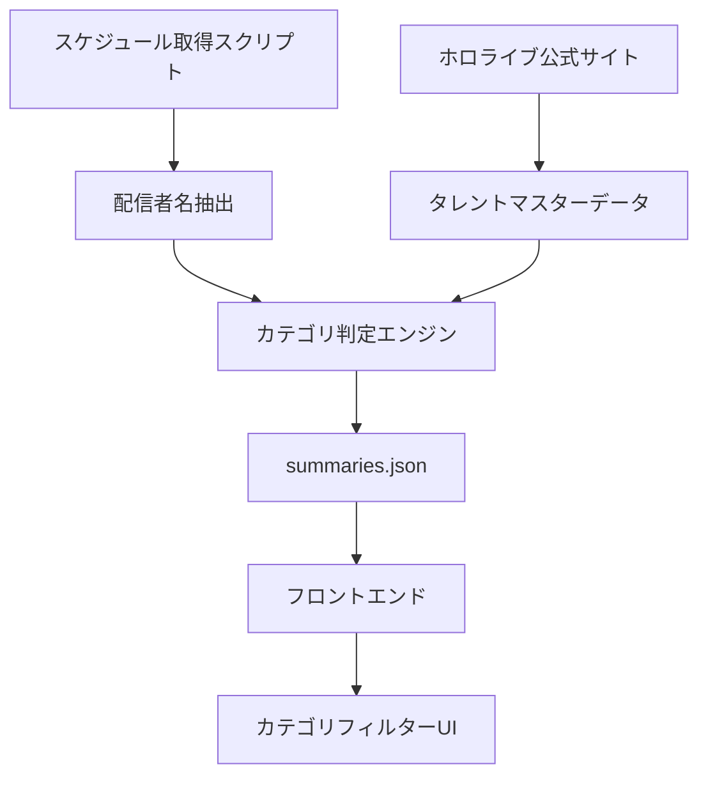

# 配信者カテゴリ分類機能 - 設計書

## 概要

ホロライブ公式サイトのタレント情報を基準として、配信者を適切なカテゴリに分類し、ユーザーがグループ別に配信者を絞り込めるシステムを設計します。

## アーキテクチャ

### システム構成図



### データフロー

1. **マスターデータ作成**: ホロライブ公式サイト情報を基にタレントマスターデータを作成
2. **スケジュール取得**: 既存のスケジュール取得処理で配信者名を抽出
3. **カテゴリ判定**: 配信者名をマスターデータと照合してカテゴリを決定
4. **データ保存**: categoryフィールドを含むJSONデータを生成
5. **UI表示**: フロントエンドでカテゴリ別フィルター機能を提供

## コンポーネントと インターフェース

### 1. タレントマスターデータ

**ファイル**: `data/talents-master.json`

```json
{
  "talents": [
    {
      "name": "さくらみこ",
      "nameEn": "Sakura Miko",
      "category": "ホロライブJP",
      "categoryEn": "Hololive JP",
      "generation": "0期生",
      "aliases": ["さくらみこ", "Sakura Miko", "みこち"]
    },
    {
      "name": "音乃瀬奏",
      "nameEn": "Otonose Kanade",
      "category": "ホロライブDEV_IS",
      "categoryEn": "Hololive DEV_IS",
      "generation": "ReGLOSS",
      "aliases": ["音乃瀬奏", "Otonose Kanade", "奏"]
    }
  ],
  "categories": [
    {
      "id": "hololive-jp",
      "nameJa": "ホロライブJP",
      "nameEn": "Hololive JP"
    },
    {
      "id": "hololive-dev-is",
      "nameJa": "ホロライブDEV_IS", 
      "nameEn": "Hololive DEV_IS"
    },
    {
      "id": "hololive-en",
      "nameJa": "ホロライブEN",
      "nameEn": "Hololive EN"
    },
    {
      "id": "hololive-id",
      "nameJa": "ホロライブID",
      "nameEn": "Hololive ID"
    },
    {
      "id": "other",
      "nameJa": "その他",
      "nameEn": "Other"
    }
  ]
}
```

### 2. カテゴリ判定エンジン

**ファイル**: `scripts/fetch-schedule/category-matcher.js`

```javascript
class CategoryMatcher {
  constructor(masterDataPath) {
    this.masterData = require(masterDataPath);
    this.talentMap = this.buildTalentMap();
  }

  buildTalentMap() {
    // タレント名とエイリアスのマッピングを構築
  }

  normalizeStreamerName(name) {
    // 配信者名の正規化（スペース、記号の除去等）
  }

  matchCategory(streamerName) {
    // 配信者名からカテゴリを判定
    // 戻り値: { category, categoryEn, confidence }
  }
}
```

### 3. 拡張されたJSONデータ構造

**ファイル**: `src/data/summaries.json`

```json
[
  {
    "videoId": "pTwFsTxsf4w",
    "title": "「パンダヒーロー」 - 音乃瀬奏＆星街すいせい＆常闇トワ＆角巻わため（cover）",
    "streamer": "音乃瀬奏",
    "category": "ホロライブDEV_IS",
    "categoryEn": "Hololive DEV_IS",
    "date": "2025-08-09T18:00:00.000Z",
    // ... 既存フィールド
  }
]
```

### 4. フロントエンドカテゴリフィルター

**HTML構造**:
```html
<div class="category-filter-container">
  <h4>📂 カテゴリで絞り込み</h4>
  <div class="category-buttons">
    <button class="category-btn active" data-category="all">すべて</button>
    <button class="category-btn" data-category="hololive-jp">ホロライブJP</button>
    <button class="category-btn" data-category="hololive-dev-is">ホロライブDEV_IS</button>
    <button class="category-btn" data-category="hololive-en">ホロライブEN</button>
    <button class="category-btn" data-category="hololive-id">ホロライブID</button>
    <button class="category-btn" data-category="other">その他</button>
  </div>
</div>

<div class="streamer-filter-container">
  <h4>🎭 配信者で絞り込み</h4>
  <div class="category-groups">
    <div class="category-group" data-category="hololive-jp">
      <h5>ホロライブJP</h5>
      <div class="streamer-buttons">
        <!-- 配信者ボタン -->
      </div>
    </div>
    <!-- 他のカテゴリグループ -->
  </div>
</div>
```

## データモデル

### TalentMaster
```typescript
interface TalentMaster {
  talents: Talent[];
  categories: Category[];
}

interface Talent {
  name: string;           // 日本語名
  nameEn: string;         // 英語名
  category: string;       // カテゴリ（日本語）
  categoryEn: string;     // カテゴリ（英語）
  generation: string;     // 世代情報
  aliases: string[];      // エイリアス（表記揺れ対応）
}

interface Category {
  id: string;            // カテゴリID
  nameJa: string;        // 日本語名
  nameEn: string;        // 英語名
}
```

### ArchiveData (拡張)
```typescript
interface ArchiveData {
  videoId: string;
  title: string;
  streamer: string;
  category: string;       // 新規追加
  categoryEn: string;     // 新規追加
  date: string;
  // ... 既存フィールド
}
```

## エラーハンドリング

### 1. カテゴリ判定エラー
- **未知の配信者**: "その他" カテゴリに分類し、ログに記録
- **マスターデータ読み込みエラー**: デフォルトカテゴリを使用
- **名前正規化エラー**: 元の名前でマッチングを試行

### 2. フロントエンドエラー
- **カテゴリデータ不正**: 全配信者を表示
- **フィルター処理エラー**: エラーログを出力し、デフォルト表示に戻る

### 3. データ整合性エラー
- **categoryフィールド欠損**: 既存データとの互換性を保持
- **不正なカテゴリ値**: "その他" として扱う

## テスト戦略

### 1. ユニットテスト
- `CategoryMatcher.matchCategory()`: 各種配信者名でのカテゴリ判定
- `CategoryMatcher.normalizeStreamerName()`: 名前正規化処理
- フロントエンドフィルター機能

### 2. 統合テスト
- スケジュール取得からカテゴリ付与までの全体フロー
- マスターデータ更新時の既存データへの影響
- 多言語表示の切り替え

### 3. パフォーマンステスト
- 大量配信者データでのフィルター応答時間
- メモリ使用量の測定
- カテゴリ切り替え時のUI応答性

## セキュリティ考慮事項

### 1. データ検証
- マスターデータの形式検証
- 不正なカテゴリ値の検出・除外
- XSS対策（配信者名の適切なエスケープ）

### 2. 入力検証
- ユーザー入力（検索等）のサニタイズ
- URLパラメータの検証

## パフォーマンス最適化

### 1. データ構造最適化
- カテゴリマッピングのハッシュテーブル化
- 配信者名正規化結果のキャッシュ
- フロントエンドでの仮想スクロール（必要に応じて）

### 2. レンダリング最適化
- カテゴリ切り替え時の差分更新
- 配信者ボタンの遅延ロード
- CSSアニメーションの最適化

## 運用・保守

### 1. マスターデータ更新手順
1. `data/talents-master.json` を手動編集
2. バリデーションスクリプトで検証
3. テスト環境での動作確認
4. 本番環境へのデプロイ

### 2. 監視項目
- 未知の配信者の検出頻度
- カテゴリ判定の精度
- フィルター機能の使用状況

### 3. ログ出力
- カテゴリ判定結果（配信者名、判定カテゴリ、信頼度）
- 未知配信者の検出ログ
- エラー発生時の詳細情報