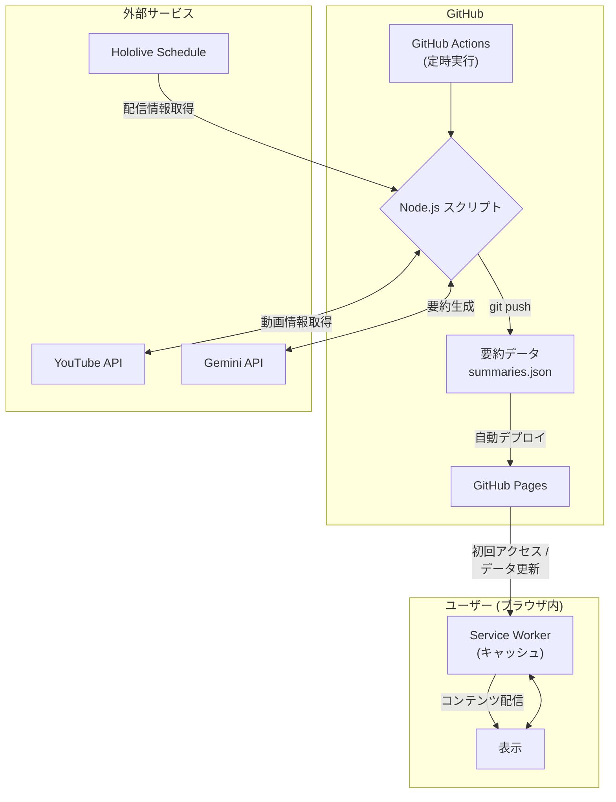
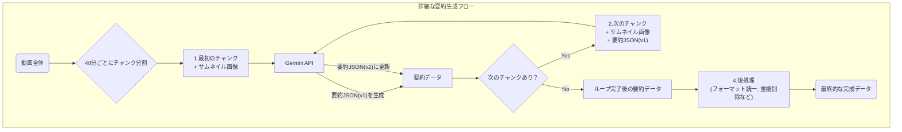

# ホロサマリー


ホロライブプロダクションのYouTubeライブ配信アーカイブをAIによって自動で要約し、一覧で閲覧できるWebサイトです。

**Webサイトはこちら 👉 [https://aegisfleet.github.io/live-stream-summarizer/](https://aegisfleet.github.io/live-stream-summarizer/)**

## 概要

日々数多くのライブ配信が行われており、すべてのアーカイブを視聴することは時間的に困難です。このサイトでは、配信内容をAIによって自動で要約し提供することで、ファンがより多くのコンテンツに触れる機会を創出することを目指しています。

### 主な機能

- **配信アーカイブの要約閲覧**
  - 配信の概要（200字程度）
  - 配信の雰囲気
  - 主要なトピックや見どころ（タイムスタンプ付き）
  - 内容を表すタグ
- **配信者名によるフィルタリング**
- **タグによるフィルタリング**
- **あとで見る機能**
  - 気になった配信をリストに保存し、後からまとめて確認できます。
- **シェア機能**
  - 各配信のタイトルとURLをコピーしたり、𝕏 (旧Twitter) で共有したりできます。
- **レスポンシブデザイン対応**
- **PWA (Progressive Web Apps) 対応**
  - オフライン環境でも閲覧可能です（一度読み込んだデータに限る）。
  - スマートフォンやPCのホーム画面にインストールして、アプリのように利用できます。
- **多言語対応（日/英）**
  - ユーザーの言語設定をブラウザに記憶し、次回以降のアクセス時に自動で適切な言語のページへリダイレクトします。

## システム構成

本システムは、**完全に無料のサービスのみ**で構築・運用されているのが最大の特徴です。GitHub Actionsを中核としてデータ収集・加工・コンテンツ生成を自動化し、GitHub Pagesで静的サイトとして公開する構成を取っています。



### 利用技術スタック

- **ホスティング**: **GitHub Pages**
  - > GitHubが提供する、静的なWebサイトを公開するためのホスティングサービスです。公開リポジトリであれば無料で利用できます。
- **CI/CD・自動化**: **GitHub Actions**
  - > GitHubに組み込まれている、様々な処理を自動化するための仕組みです。公開リポジトリなら無料枠の範囲で自由に利用できます。
- **PWA (Progressive Web Apps)**
  - > Webサイトをネイティブアプリのように利用可能にする技術です。Service Workerによるオフライン対応や、Web App Manifestによるホーム画面へのインストール機能などを提供します。
- **コンテンツ生成**: **Gemini API (model: gemini-2.5-flash)**
  - > Googleが開発した高性能な生成AIです。動画を直接理解して処理する能力（マルチモーダル）を持っています。一定の利用量までは無料で使えます。
- **データソース**:
  - `schedule.hololive.tv`: 配信スケジュールの取得
  - `YouTube Data API v3`: 動画情報の取得
- **開発支援AI**:
  - **GitHub Copilot (Agentモード)**: コーディング支援
  - **Gemini Code Assist (Agentモード)**: コーディング支援

### 要約生成プロセスの詳細

長時間の配信を一度に要約するのは困難なため、本システムでは動画を40分ずつのチャンクに分割し、順次処理していく手法を取っています。この反復的なプロセスにより、動画全体の文脈を維持した一貫性のある要約を生成します。

1. **最初のチャンクの要約**: まず、動画の最初のチャンクと**サムネイル画像**をGemini APIに送信します。サムネイルから出演者などの情報を補完し、基本的な要約情報（概要、見どころ、タグなど）を含むJSONデータを生成します。
2. **要約の更新と追記**: 次のチャンクを処理する際には、その動画セグメントとサムネイル画像に加えて、**前回生成した要約JSON**も一緒にAPIへ送信します。プロンプトで「このJSONデータを更新・追記する形で、新しい期間の情報を追加してください」と指示することで、AIはこれまでの内容を把握した上で、全体の概要（`overview`）をより適切な内容に更新し、見どころ（`highlights`）やタグ（`tags`）を追記します。
3. **繰り返し**: このプロセスを動画の最後まで繰り返します。
4. **後処理**: 全てのチャンクの処理が終わった後、生成されたデータに対して最終的な整形を行います。具体的には、見どころのタイムスタンプのフォーマットを統一したり、チャンク間で重複してしまった見どころやタグを整理したりして、データの品質を高めます。
この仕組みにより、配信の最初から最後まで見どころが偏りなく抽出され、全体の流れを反映した精度の高い要約が実現されています。



## ディレクトリ構成

```text
.
├── .env.example          # 環境変数のサンプルファイル。`YOUTUBE_API_KEY`と`GEMINI_API_KEY`を設定します。
├── .gitignore            # Gitでバージョン管理しないファイルやディレクトリを指定します。
├── LICENSE               # プロジェクトのライセンス情報です。
├── README.md             # このファイルです。プロジェクトの概要や使い方を説明します。
├── package-lock.json     # 依存パッケージのバージョンをロックするファイルです。
├── package.json          # プロジェクトの情報や依存パッケージを管理するファイルです。
├── server.js             # 開発用のローカルサーバーです。
├── .github/
│   └── workflows/
│       ├── cleanup-summaries.yml # GitHub Actionsのワークフローファイル。定期的に古いサマリーデータを削除します。
│       ├── deploy-pages.yml  # GitHub Actionsのワークフローファイル。GitHub Pagesへのデプロイを自動化します。
│       └── update-summaries.yml # GitHub Actionsのワークフローファイル。定期的にサマリーを更新します。
├── data/
│   ├── archives.json     # アーカイブされた配信の情報を保存するJSONファイルです。
│   └── schedules.json    # 配信スケジュールを保存するJSONファイルです。
├── docs/
│   ├── CODING_GUIDELINES.md # コーディング規約を記述するファイルです。
│   └── REQUIREMENTS.md      # プロジェクトの要件を記述するファイルです。
├── scripts/
│   ├── check-archive/
│   │   └── index.js      # アーカイブを確認するスクリプトです。
│   ├── cleanup-summaries/
│   │   └── index.js      # 古いサマリーデータを削除するスクリプトです。
│   ├── fetch-schedule/
│   │   └── index.js      # 配信スケジュールを取得するスクリプトです。
│   ├── generate-pages/
│   │   └── index.js      # 各配信の個別ページを生成するスクリプトです。
│   └── summarize/
│       └── index.js      # 配信内容を要約するスクリプトです。
└── src/
    ├── index.html        # WebページのメインHTMLファイルです。
    ├── manifest.json     # PWAのための設定ファイルです。
    ├── service-worker.js # オフライン対応を実現するService Workerのスクリプトです。
    ├── css/
    │   └── style.css     # スタイルを定義するCSSファイルです。
    ├── data/
    │   └── summaries.json    # 生成されたサマリーを保存するJSONファイルです。
    ├── js/
    │   ├── detail-page.js # 詳細ページのインタラクションを制御するJavaScriptファイルです。
    │   ├── language-handler.js # ユーザーの言語設定に応じて自動的にリダイレクトを行うJavaScriptファイルです。
    │   ├── main.js       # Webページの動作を制御するJavaScriptファイルです。
    │   └── utils.js      # 共通で利用する関数をまとめたJavaScriptファイルです。
    └── images/
        ├── character.png # イメージキャラクターの画像ファイルです。
        ├── favicon.png   # ファビコンの画像ファイルです。
        └── ogp.png       # OGP画像のファイルです。
```

## セットアップ

1. 必要な環境変数を`.env`ファイルに設定します。

    ```bash
    YOUTUBE_API_KEY=your_youtube_api_key
    GEMINI_API_KEY=your_gemini_api_key
    ```

2. 依存パッケージのインストール

    ```bash
    npm install
    ```

3. ローカルでの実行

    ```bash
    # 配信スケジュールの取得
    npm run fetch-schedule

    # アーカイブの確認
    npm run check-archive

    # 新規動画の要約を生成（最大10件）
    npm run summarize

    # 特定の動画の要約を更新
    npm run summarize -- xxxxxxxxxxx

    # 各配信の個別ページを生成
    npm run generate-pages

    # 古いサマリーデータの削除（14日より前のデータ）
    npm run cleanup-summaries

    # 開発サーバーの起動
    npm start
    ```

## イメージキャラクター


## ライセンス

このプロジェクトはMITライセンスの下で公開されています。
