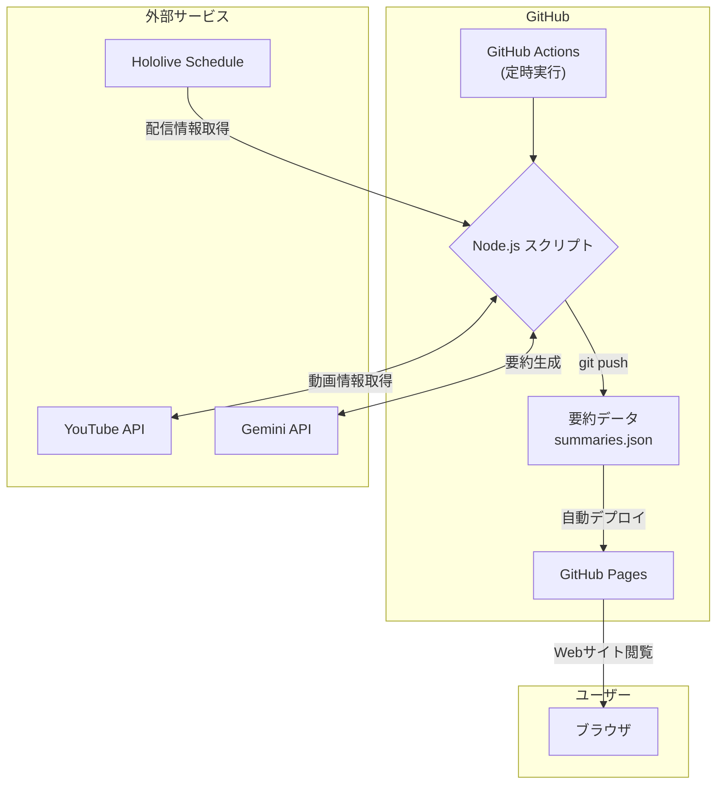

# ホロライブ配信アーカイブサマリー


ホロライブプロダクションのYouTubeライブ配信アーカイブをAIによって自動で要約し、一覧で閲覧できるWebサイトです。

**Webサイトはこちら 👉 [https://aegisfleet.github.io/live-stream-summarizer/](https://aegisfleet.github.io/live-stream-summarizer/)**

## 概要

日々数多くのライブ配信が行われており、すべてのアーカイブを視聴することは時間的に困難です。このサイトでは、配信内容をAIによって自動で要約し提供することで、ファンがより多くのコンテンツに触れる機会を創出することを目指しています。

### 主な機能

- **配信アーカイブの要約閲覧**
  - 配信の概要（200字程度）
  - 配信の雰囲気
  - 主要なトピックや見どころ（タイムスタンプ付き）
  - 内容を表すタグ
- **配信者名によるフィルタリング**
- **タグによるフィルタリング**
- **レスポンシブデザイン対応**

## システム構成

本システムは、**完全に無料のサービスのみ**で構築・運用されているのが最大の特徴です。GitHub Actionsを中核としてデータ収集・加工・コンテンツ生成を自動化し、GitHub Pagesで静的サイトとして公開する構成を取っています。



### 利用技術スタック

- **ホスティング**: **GitHub Pages**
  - > GitHubが提供する、静的なWebサイトを公開するためのホスティングサービスです。公開リポジトリであれば無料で利用できます。
- **CI/CD・自動化**: **GitHub Actions**
  - > GitHubに組み込まれている、様々な処理を自動化するための仕組みです。公開リポジトリなら無料枠の範囲で自由に利用できます。
- **コンテンツ生成**: **Gemini API (model: gemini-2.5-flash)**
  - > Googleが開発した高性能な生成AIです。動画を直接理解して処理する能力（マルチモーダル）を持っています。一定の利用量までは無料で使えます。
- **データソース**:
  - `schedule.hololive.tv`: 配信スケジュールの取得
  - `YouTube Data API v3`: 動画情報の取得
- **開発支援AI**:
  - **GitHub Copilot (Agentモード)**: コーディング支援
  - **Gemini Code Assist (Agentモード)**: コーディング支援

## ディレクトリ構成

```text
.
├── .env.example          # 環境変数のサンプルファイル。`YOUTUBE_API_KEY`と`GEMINI_API_KEY`を設定します。
├── .gitignore            # Gitでバージョン管理しないファイルやディレクトリを指定します。
├── LICENSE               # プロジェクトのライセンス情報です。
├── README.md             # このファイルです。プロジェクトの概要や使い方を説明します。
├── package-lock.json     # 依存パッケージのバージョンをロックするファイルです。
├── package.json          # プロジェクトの情報や依存パッケージを管理するファイルです。
├── server.js             # 開発用のローカルサーバーです。
├── .github/
│   └── workflows/
│       ├── deploy-pages.yml  # GitHub Actionsのワークフローファイル。GitHub Pagesへのデプロイを自動化します。
│       └── update-summaries.yml # GitHub Actionsのワークフローファイル。定期的にサマリーを更新します。
├── config/
│   └── default.json      # アプリケーションの設定ファイルです。
├── data/
│   ├── archives.json     # アーカイブされた配信の情報を保存するJSONファイルです。
│   └── schedules.json    # 配信スケジュールを保存するJSONファイルです。
├── docs/
│   ├── CODING_GUIDELINES.md # コーディング規約を記述するファイルです。
│   └── REQUIREMENTS.md      # プロジェクトの要件を記述するファイルです。
├── scripts/
│   ├── check-archive/
│   │   └── index.js      # アーカイブを確認するスクリプトです。
│   ├── fetch-schedule/
│   │   └── index.js      # 配信スケジュールを取得するスクリプトです。
│   └── summarize/
│       └── index.js      # 配信内容を要約するスクリプトです。
└── src/
    ├── index.html        # WebページのメインHTMLファイルです。
    ├── css/
    │   └── style.css     # スタイルを定義するCSSファイルです。
    ├── data/
    │   └── summaries.json    # 生成されたサマリーを保存するJSONファイルです。
    └── js/
        └── main.js       # Webページの動作を制御するJavaScriptファイルです。
```

## セットアップ

1. 必要な環境変数を`.env`ファイルに設定します。

    ```bash
    YOUTUBE_API_KEY=your_youtube_api_key
    GEMINI_API_KEY=your_gemini_api_key
    ```

2. 依存パッケージのインストール

    ```bash
    npm install
    ```

3. ローカルでの実行

    ```bash
    # 配信スケジュールの取得
    npm run fetch-schedule

    # アーカイブの確認
    npm run check-archive

    # 新規動画の要約を生成（最大10件）
    npm run summarize

    # 特定の動画の要約を更新
    npm run summarize -- --videoId=xxxxxxxxxxx

    # 開発サーバーの起動
    npm start
    ```

## イメージキャラクター


## ライセンス

このプロジェクトはMITライセンスの下で公開されています。
