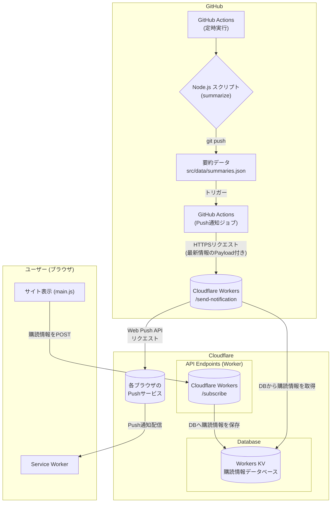

# Web Push通知機能 設計書 (Cloudflare Workers版)

## 1\. 概要

本機能は、Web Push通知のバックエンド（購読情報の管理と通知の送信）を **Cloudflare Workers** と **Workers KV** を用いて構築するものである。既存のGitHub Actionsを中心とした静的サイト生成の仕組みと連携し、完全に無料でスケーラブルなPush通知機能を実現する。

-----

## 2\. システム構成

GitHub Pagesでホスティングされている静的サイト `https://aegisfleet.github.io/live-stream-summarizer/` と、サーバーレスなAPIを提供するCloudflare Workersを連携させる。



### 構成要素

| 要素 | 役割 |
| :--- | :--- |
| **Cloudflare Workers** | ・ユーザーからの購読情報を受け取り、Workers KVに保存するAPI (`/subscribe`) を提供。\<br\>・GitHub Actionsからのリクエストをトリガーに、全購読者へ通知を送信するAPI (`/send-notification`) を提供。 |
| **Workers KV** | Cloudflareが提供するキーバリューストア型データベース。ユーザーのPush購読情報を永続的に保存する。 |
| **フロントエンド (`main.js`)** | ・通知許可を求めるUIの表示と制御。\<br\>・ユーザーが許可した場合、取得した購読情報をCloudflare Workersの`/subscribe`エンドポイントへ送信する。 |
| **Service Worker (`service-worker.js`)** | ・Push通知の購読処理。\<br\>・バックグラウンドでのPushイベント受信と通知の表示。 |
| **GitHub Actions (`update-summaries.yml`)** | ・要約更新後、Cloudflare Workersの`/send-notification`エンドポイントにHTTPSリクエストを送信するジョブを実行する。 |

-----

## 3\. Cloudflare Workers セットアップ手順

### ステップ1: Cloudflareアカウントの作成

1. [Cloudflareの公式サイト](https://www.cloudflare.com/ja-jp/)にアクセスし、「サインアップ」からアカウントを無料で作成します。
2. サイトの追加を求められますが、Workersを利用するだけであればドメインの登録は必須ではありません。ダッシュボードに直接進んでください。

### ステップ2: VAPIDキーの確認

提供いただいた公開鍵 `BNwCsdDI5d5pHqITS3xxzCdtpd7feeGyu2jjEQZz1XsPw_QcoaeEGkwJd8wDd6AZNPeFsHNVilxgIkj5ovO6CO4` に対応する\*\*秘密鍵(Private Key)\*\*を準備してください。

もし秘密鍵が不明な場合は、お手数ですが再度キーペアを生成し直す必要があります。その際はローカルの開発環境で以下のコマンドを実行し、生成された公開鍵と秘密鍵を両方ともメモしておいてください。

```bash
# npxはNode.jsに付属するツール
npx web-push generate-vapid-keys
```

### ステップ3: Workers KV（データベース）の作成

1. Cloudflareダッシュボードの左メニューから **「Workers & Pages」** を選択します。
2. **「KV」** タブを開き、「Create a namespace」をクリックします。
3. `Namespace Name` に `PUSH_SUBSCRIPTIONS` と入力し、「Add」をクリックします。

### ステップ4: Worker（API）の作成と設定 (最新UI対応版)

1. **「Workers & Pages」** の **「概要」** タブに戻り、「Create Application」をクリックします。
2. 「Create Worker」を選択し、Workerの名前を `holosumm-pusher` に設定して「Deploy」をクリックします。これにより、WorkerのURLは `holosumm-pusher.aegisfleet.workers.dev` となります。
3. デプロイが完了したら、「Edit code」をクリックしてWorkerの編集画面を開きます。
4. 後述 **4.3. Cloudflare Worker スクリプト** のコードをエディタに貼り付けます。

#### 5\. WorkerとKVの連携設定

1. Workerのデプロイ後、`holosumm-pusher` の管理画面に戻ります。
2. **「Settings」** タブを選択します。
3. 左側のメニューから **「Variables」** をクリックします。
4. **「KV Namespace Bindings」** のセクションまでスクロールし、「Add binding」をクリックします。
      * **Variable name**: `PUSH_SUBSCRIPTIONS`
      * **KV namespace**: プルダウンから、ステップ3で作成した `PUSH_SUBSCRIPTIONS` を選択します。
5. 「Save and deploy」をクリックして設定を保存します。

#### 6\. シークレット変数の設定

1. 同じく **「Settings」** \> **「Variables」** の画面内にある **「Environment Variables」** セクションで「Add variable」をクリックします。
2. 以下の**3つの変数**を一つずつ追加していきます。`Value`を入力したら「Encrypt」をクリックして暗号化してください。
      * **`VAPID_PUBLIC_KEY`**: `BNwCsdDI5d5pHqITS3xxzCdtpd7feeGyu2jjEQZz1XsPw_QcoaeEGkwJd8wDd6AZNPeFsHNVilxgIkj5ovO6CO4`
      * **`VAPID_PRIVATE_KEY`**: 上記公開鍵に対応する**秘密鍵**
      * **`AUTH_KEY`**: 自身で生成したランダムで長い文字列（GitHub Actions認証用）
3. すべての変数を追加したら、「Save and deploy」をクリックします。

-----

## 4\. 実装詳細

### 4.1. フロントエンド (`src/js/main.js`の改修)

`VAPID_PUBLIC_KEY`と`SUBSCRIBE_ENDPOINT_URL`を実際の値に置き換えます。

```javascript
// main.js に追記する処理の例

const VAPID_PUBLIC_KEY = 'BNwCsdDI5d5pHqITS3xxzCdtpd7feeGyu2jjEQZz1XsPw_QcoaeEGkwJd8wDd6AZNPeFsHNVilxgIkj5ovO6CO4';
const SUBSCRIBE_ENDPOINT_URL = 'https://holosumm-pusher.aegisfleet.workers.dev/subscribe';

// ... (通知ボタンのクリックイベントリスナー) ...

async function subscribeUserToPush() {
    try {
        const serviceWorkerRegistration = await navigator.serviceWorker.ready;
        const subscription = await serviceWorkerRegistration.pushManager.subscribe({
            userVisibleOnly: true,
            applicationServerKey: urlBase64ToUint8Array(VAPID_PUBLIC_KEY)
        });
        await sendSubscriptionToServer(subscription);
        console.log('Push購読情報をサーバーに送信しました。');
    } catch (error) {
        console.error('Push購読に失敗しました:', error);
    }
}

async function sendSubscriptionToServer(subscription) {
    try {
        const response = await fetch(SUBSCRIBE_ENDPOINT_URL, {
            method: 'POST',
            headers: { 'Content-Type': 'application/json' },
            body: JSON.stringify(subscription),
        });
        if (!response.ok) {
            throw new Error('サーバーへの購読情報送信に失敗しました。');
        }
    } catch (error) {
        console.error(error);
    }
}

function urlBase64ToUint8Array(base64String) {
    const padding = '='.repeat((4 - base64String.length % 4) % 4);
    const base64 = (base64String + padding).replace(/-/g, '+').replace(/_/g, '/');
    const rawData = window.atob(base64);
    const outputArray = new Uint8Array(rawData.length);
    for (let i = 0; i < rawData.length; ++i) {
        outputArray[i] = rawData.charCodeAt(i);
    }
    return outputArray;
}
```

### 4.2. Service Worker (`src/service-worker.js`の改修)

通知クリック時のURLを正しく開くために、サイトのオリジン（ドメイン部分）を定数として定義しておくと便利です。

```javascript
// service-worker.js の先頭あたりにサイトのURLを定義
const SITE_URL = 'https://aegisfleet.github.io/live-stream-summarizer/';

self.addEventListener('push', event => {
    let data;
    try {
        data = event.data.json();
    } catch (e) {
        data = {
            title: '新しい要約が追加されました',
            body: 'サイトで最新の情報を確認しましょう！',
            icon: '/live-stream-summarizer/images/favicon.png',
            url: SITE_URL
        };
    }

    const options = {
        body: data.body,
        icon: data.icon,
        badge: '/live-stream-summarizer/images/favicon.png',
        data: {
            url: data.url
        }
    };

    event.waitUntil(
        self.registration.showNotification(data.title, options)
    );
});


self.addEventListener('notificationclick', event => {
    console.log('[Service Worker] Notification click Received.');

    event.notification.close();

    const urlToOpen = event.notification.data.url || SITE_URL;

    event.waitUntil(
        clients.matchAll({
            type: "window"
        }).then(clientList => {
            for (const client of clientList) {
                if (client.url === urlToOpen && 'focus' in client) {
                    return client.focus();
                }
            }
            if (clients.openWindow) {
                return clients.openWindow(urlToOpen);
            }
        })
    );
});
```

### 4.3. Cloudflare Worker スクリプト (警告解決版)

`web-push`ライブラリに依存せず、Cloudflare Workersの標準機能（`fetch`, `crypto`）のみで動作するコードです。

```javascript
// Cloudflare Worker Script (Fixed VAPID key handling)

export default {
    async fetch(request, env) {
        if (request.method === 'OPTIONS') {
            return handleOptions(request);
        }

        const url = new URL(request.url);
        let response;

        try {
            if (url.pathname === '/subscribe' && request.method === 'POST') {
                response = await handleSubscribe(request, env);
            } else if (url.pathname === '/send-notification' && request.method === 'POST') {
                response = await handleSendNotification(request, env);
            } else {
                response = new Response('Not Found', { status: 404 });
            }
        } catch (e) {
            console.error(e);
            response = new Response(`Internal Server Error: ${e.message}`, { status: 500 });
        }
        
        const newHeaders = new Headers(response.headers);
        const cors = corsHeaders();
        for (const key in cors) {
            newHeaders.set(key, cors[key]);
        }

        return new Response(response.body, {
            status: response.status,
            statusText: response.statusText,
            headers: newHeaders,
        });
    },
};

/**
 * 購読情報をKVに保存
 */
async function handleSubscribe(request, env) {
    const subscription = await request.json();
    if (!subscription || !subscription.endpoint) {
        return new Response('Invalid subscription', { status: 400 });
    }
    const key = btoa(subscription.endpoint).replace(/=/g, '');
    await env.PUSH_SUBSCRIPTIONS.put(key, JSON.stringify(subscription));
    return new Response(JSON.stringify({ success: true }), { status: 201 });
}

/**
 * 全ての購読者へ通知を送信
 */
async function handleSendNotification(request, env) {
    const authKey = request.headers.get('Authorization');
    if (authKey !== `Bearer ${env.AUTH_KEY}`) {
        return new Response('Unauthorized', { status: 401 });
    }

    const notificationPayload = await request.json();
    const vapidDetails = {
        subject: `https://aegisfleet.github.io`,
        publicKey: env.VAPID_PUBLIC_KEY,
        privateKey: env.VAPID_PRIVATE_KEY,
    };
    
    const list = await env.PUSH_SUBSCRIPTIONS.list();
    const promises = [];

    for (const key of list.keys) {
        const subscriptionString = await env.PUSH_SUBSCRIPTIONS.get(key.name);
        if (subscriptionString) {
            const subscription = JSON.parse(subscriptionString);
            promises.push(
                triggerPushMsg(subscription, JSON.stringify(notificationPayload), vapidDetails)
                .catch(err => {
                    if (err.statusCode === 410 || err.statusCode === 404) {
                        console.log(`Subscription ${key.name} is gone. Deleting.`);
                        return env.PUSH_SUBSCRIPTIONS.delete(key.name);
                    }
                    console.error(`Failed to send to ${key.name}:`, err);
                })
            );
        }
    }

    await Promise.all(promises);
    return new Response(JSON.stringify({ success: true, sent: promises.length }));
}

function handleOptions(request) {
    if (
        request.headers.get('Origin') !== null &&
        request.headers.get('Access-Control-Request-Method') !== null &&
        request.headers.get('Access-Control-Request-Headers') !== null
    ) {
        return new Response(null, { headers: corsHeaders() });
    } else {
        return new Response(null, { headers: { Allow: 'POST, OPTIONS' } });
    }
}

function corsHeaders() {
    return {
        'Access-Control-Allow-Origin': 'https://aegisfleet.github.io',
        'Access-Control-Allow-Methods': 'POST, OPTIONS',
        'Access-Control-Allow-Headers': 'Content-Type, Authorization',
    };
}

// VAPID & Web Push Protocol Logic
async function triggerPushMsg(subscription, payload, vapidDetails) {
    const { endpoint } = subscription;
    const origin = new URL(endpoint).origin;

    const token = await getVapidToken(origin, vapidDetails);

    const headers = {
        'TTL': 60,
        'Authorization': `WebPush ${token}`,
        'Content-Encoding': 'aesgcm' // ペイロードを送信しない場合でも指定が必要な場合がある
    };

    const response = await fetch(endpoint, {
        method: 'POST',
        headers,
        body: payload, // ペイロードをそのまま送信
    });

    if (response.status >= 400 && response.status < 500) {
        const error = new Error(`Push subscription failed with status code: ${response.status}`);
        error.statusCode = response.status;
        throw error;
    }
}

async function getVapidToken(audience, vapidDetails) {
    const header = { "alg": "ES256", "typ": "JWT" };
    const payload = {
        "aud": audience,
        "exp": Math.floor(Date.now() / 1000) + (12 * 60 * 60),
        "sub": "mailto:example@example.com",
    };

    const b64Header = urlsafeBase64Encode(JSON.stringify(header));
    const b64Payload = urlsafeBase64Encode(JSON.stringify(payload));
    const signingInput = `${b64Header}.${b64Payload}`;
    
    const { x, y } = getPublicKeyXY(vapidDetails.publicKey);

    const privateKeyJwk = {
        kty: 'EC',
        crv: 'P-256',
        d: vapidDetails.privateKey,
        x: x,
        y: y,
    };

    const privateKey = await crypto.subtle.importKey(
        'jwk',
        privateKeyJwk,
        { name: 'ECDSA', namedCurve: 'P-256' },
        true,
        ['sign']
    );

    const signature = await crypto.subtle.sign(
        { name: 'ECDSA', hash: 'SHA-256' },
        privateKey,
        new TextEncoder().encode(signingInput)
    );
    
    const b64Signature = urlsafeBase64Encode(signature);
    return `${signingInput}.${b64Signature}`;
}

function urlsafeBase64Encode(data) {
    const base64 = typeof data === 'string'
        ? btoa(unescape(encodeURIComponent(data)))
        : btoa(String.fromCharCode.apply(null, new Uint8Array(data)));
    return base64.replace(/\+/g, '-').replace(/\//g, '_').replace(/=/g, '');
}

function urlsafeBase64Decode(base64) {
    const processed = base64.replace(/-/g, '+').replace(/_/g, '/');
    const decoded = atob(processed);
    const buffer = new Uint8Array(decoded.length);
    for (let i = 0; i < decoded.length; i++) {
        buffer[i] = decoded.charCodeAt(i);
    }
    return buffer;
}

function getPublicKeyXY(publicKey_b64) {
    const decoded = urlsafeBase64Decode(publicKey_b64);
    // The first byte (0x04) indicates uncompressed key.
    // The next 32 bytes are the x-coordinate, and the following 32 are the y-coordinate.
    const x = decoded.slice(1, 33);
    const y = decoded.slice(33, 65);
    return {
        x: urlsafeBase64Encode(x),
        y: urlsafeBase64Encode(y)
    };
}
```

### 4.4. GitHub Actions (`.github/workflows/update-summaries.yml`の改修)

```yaml
# .github/workflows/update-summaries.yml
# ... (既存のステップ) ...

      - name: Send Push Notification
        if: steps.check_changes.outputs.has_changes == 'true'
        run: |
          LATEST_TITLE=$(jq -r '.[0].title' src/data/summaries.json)
          LATEST_STREAMER=$(jq -r '.[0].streamer' src/data/summaries.json)
          LATEST_VIDEO_ID=$(jq -r '.[0].videoId' src/data/summaries.json)
          
          PAGE_URL="https://aegisfleet.github.io/live-stream-summarizer/pages/${LATEST_VIDEO_ID}.html"

          curl -X POST \
            "${{ secrets.CF_WORKER_URL }}/send-notification" \
            -H "Authorization: Bearer ${{ secrets.CF_AUTH_KEY }}" \
            -H "Content-Type: application/json" \
            --data-raw '{
              "title": "[新規] '"$LATEST_STREAMER"'",
              "body": "'"$LATEST_TITLE"'",
              "icon": "https://aegisfleet.github.io/live-stream-summarizer/images/character.png",
              "url": "'"$PAGE_URL"'"
            }'
```

### 4.5. GitHubリポジトリへのシークレット登録

GitHubリポジトリの `Settings` \> `Secrets and variables` \> `Actions` に、以下の2つのシークレットを登録します。

* **`CF_WORKER_URL`**: `https://holosumm-pusher.aegisfleet.workers.dev`
* **`CF_AUTH_KEY`**: ステップ4-6で設定した認証キー
